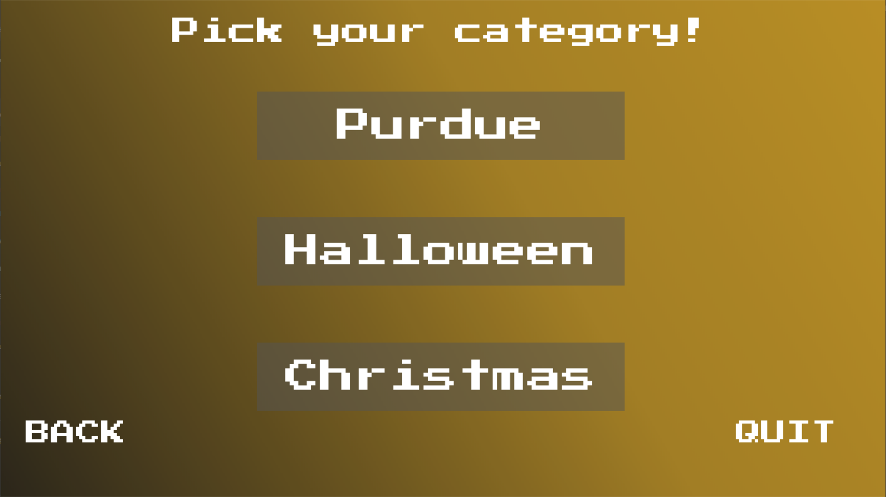
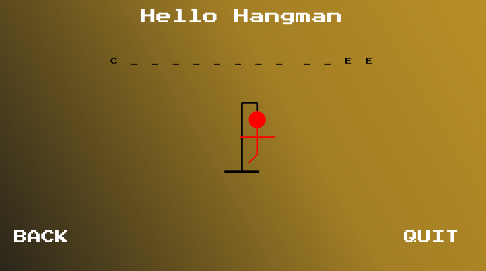

# Hello Hangman

## Table of Contents

1. [Introduction](#introduction)
2. [Features](#features)
3. [Installation](#installation)
4. [Usage](#usage)
5. [Gameplay](#gameplay)
6. [Categories](#categories)
7. [Screenshots](#screenshots)
8. [Contributing](#contributing)
9. [License](#license)

---

## Introduction

Welcome to Hello Hangman! This classic word-guessing game is brought to life with a modern twist. Hangman is a simple and fun game where you try to guess a hidden word one letter at a time. With colorful graphics and various categories to choose from, it's perfect for players of all ages.

## Features

- **Multiple Categories:** Choose from different categories, including Purdue, Halloween, and Christmas, to add variety to your gameplay.

- **Vibrant Graphics:** Enjoy eye-catching visuals and a user-friendly interface that enhances the gaming experience.

- **Engaging Music:** Immerse yourself in the game with background music that matches the chosen category.

- **Responsive Controls:** Easy-to-use controls for letter selection and navigation.

- **Win and Lose Screens:** Celebrate your victories and face the consequences of defeat with dedicated win and lose screens.

## Installation

To run Hello Hangman, follow these steps:

1. Ensure you have [Python](https://www.python.org/downloads/) installed on your computer.

2. Clone this repository or download the game files to your local machine.

3. Open your terminal or command prompt and navigate to the game's directory.

4. Install the required Python library, Pygame, using the following command:
'''
pip install pygame
'''

5. Run the game by executing the following command:
'''
python hangman.py
'''

## Usage

- Start the game by selecting "PLAY" from the main menu.

- Choose a category (Purdue, Halloween, or Christmas) to begin the game.

- Guess letters to reveal the hidden word, and try to complete the word before running out of attempts.

- Navigate using the on-screen buttons for options such as "BACK" and "QUIT."

## Gameplay

The objective of the game is to guess the hidden word letter by letter. You have a limited number of attempts to guess the word correctly. If you guess a letter that is not in the word, you lose an attempt. The game ends in one of the following ways:

- You successfully guess the entire word.
- You run out of attempts, resulting in a loss.

## Categories

### Purdue
Guess words related to Purdue University and its culture.

### Halloween
Guess spooky words associated with Halloween.

### Christmas
Guess words related to the holiday season and Christmas.

## Screenshots

Here are some screenshots from the Hangman Game:

## Contributing

Contributions to this project are welcome! If you have any ideas for improvements or bug fixes, please feel free to submit a pull request.

## License

This project is licensed under the [MIT License](LICENSE).
